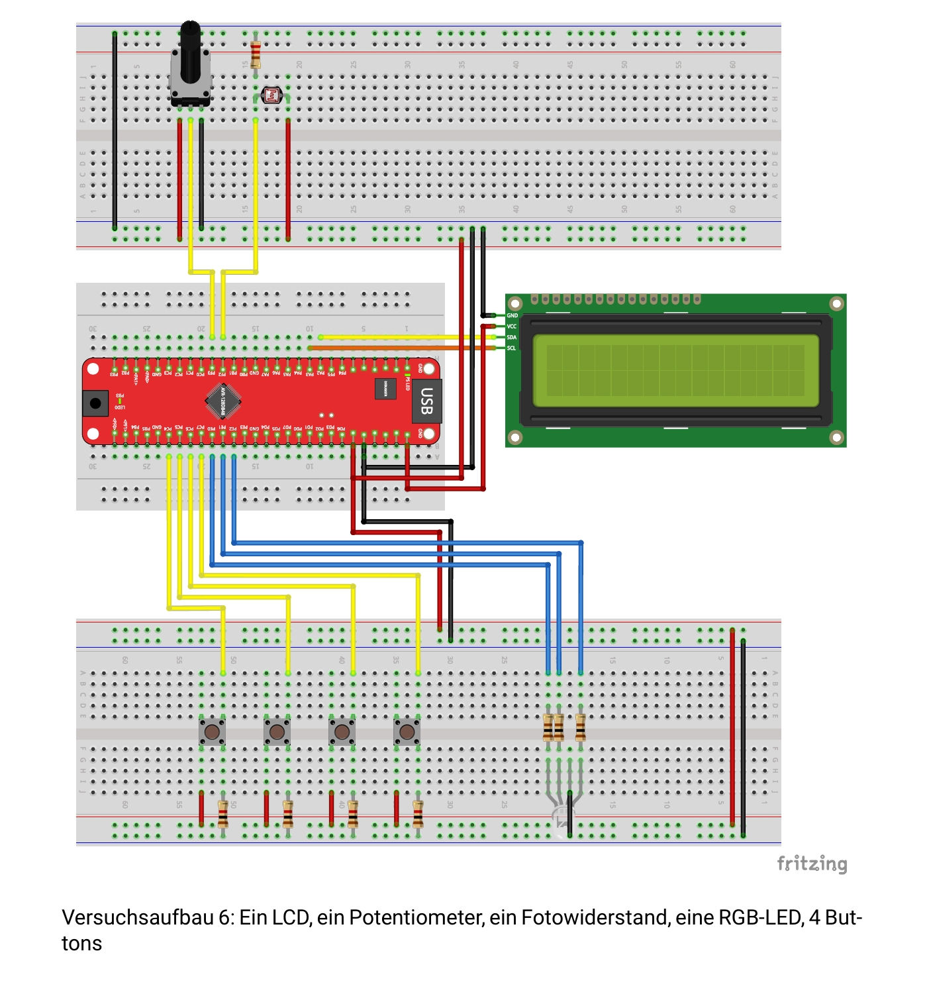
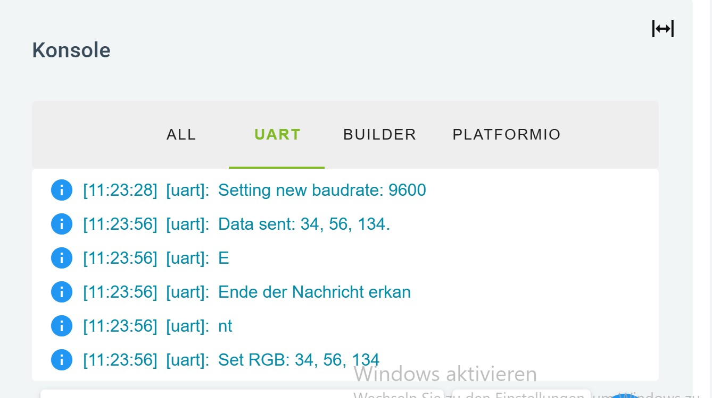
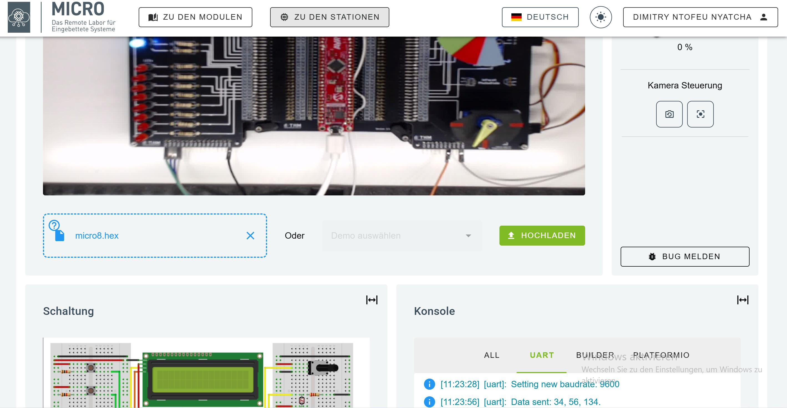

# 🔌 Übung 8: ADC & USART – Mikroprozessortechnik

Dieses Projekt wurde im Rahmen des **Mikroprozessor-Praktikums** durchgeführt und behandelt den **Analog-Digital-Wandler (ADC)** sowie die **serielle Kommunikation (USART)**.  
Ziel der Übung war es, analoge Signale mit dem Mikrocontroller **AVR128DB48 Curiosity Nano** einzulesen, diese zu verarbeiten und über ein LCD anzuzeigen.

---

## 🖼️ Schaltplan / Aufbau

📌 **Bestandteile:**
- Potentiometer  
- Fotowiderstand  
- LCD-Display  
- RGB-LED  
- 4 Buttons  

---

## 🧩 Aufgabenübersicht

### 🔸 Teil 8.1: A/D-Conversion with Potentiometer
- Spannung vom Potentiometer (0 – 3.3 V) über ADC einlesen  
- Wert auf LCD anzeigen  
- Spannung in Prozent umrechnen und darstellen  

---

### 🔸 Teil 8.2: A/D-Conversion with Photoresistor
- Fotowiderstand mit Spannungsteiler verwenden  
- Lichtintensität messen und auf LCD anzeigen  
- Prozentuale Anzeige der Helligkeit  
- Möglichkeit zur Kalibrierung der Maximalhelligkeit  

---

### 🔸 Teil 8.3: Pressed Buttons with USART
- Programm sendet bei Tastendruck (Pins C4 – C7) eine individuelle Nachricht über USART  
- Nutzung von Interrupts für mehrere Taster  
- Untersuchung der typischen Baudrate für serielle Kommunikation  

---

### 🔸 Teil 8.4: Internal Temperature Readings with USART
- Nutzung des internen Temperatursensors des AVR128DB48  
- Messung per ADC, Ausgabe über USART in Kelvin und °C  
- Sekundengenaue Messungen mit Timer-Unterstützung  

---

### 🔸 Teil 8.5: RGB-LED Control with USART
- Über die serielle Schnittstelle ein RGB-Wert an den Mikrocontroller senden  
- LED an den Pins E0 bis E2 steuern und Farbe entsprechend anzeigen  

---

## ⚙️ Tools & Kommunikation

- **USART (Universal Synchronous/Asynchronous Receiver Transmitter)**: Serielle Schnittstelle zur Datenübertragung  
- Nutzung des **Curiosity Virtual COM Ports** zur Kommunikation mit dem PC  
- Datenübertragung und Debugging mit **Microchip Data Visualizer**  

---

## Visualisierung 

## 🧑‍💻 Autor
Student **[DIMITRY NTOFEU NYATCHA]**  
Kurs: *Mikroprozessortechnik – Praktikum*  
Sprache: **C / Embedded**

---

## 🔒 Lizenz / Verwendung
Privates Uni-Projekt – ausschließlich zu Lern- und Demonstrationszwecken gedacht.